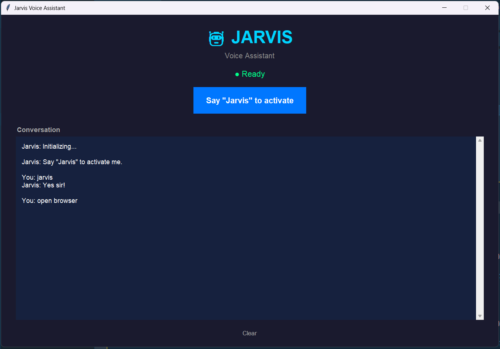

# 🤖 Jarvis — AI Voice Assistant

A Python-based personal voice assistant powered by Google Gemini AI. Jarvis listens for a wake word, understands natural language commands, and performs real-world actions on your machine — all through voice.



---

## ✨ Features

- 🎤 **Wake word detection** — Say "Jarvis" to activate
- 🌐 **Browser control** — Open Google, YouTube, LinkedIn, new tabs, close tabs
- 🔍 **Voice search** — Search the web hands-free
- 🎵 **Music playback** — Play songs from your personal music library
- 📰 **Live news** — Fetches and reads top headlines via NewsAPI
- ⏯️ **Playback control** — Pause and resume media
- 🤖 **AI fallback** — Powered by Google Gemini for anything not covered by built-in commands
- 🖥️ **Desktop UI** — Clean Tkinter interface with live conversation transcript and status indicator

---

## 🛠️ Tech Stack

| Technology         | Purpose                           |
| ------------------ | --------------------------------- |
| Python             | Core language                     |
| speech_recognition | Voice input & transcription       |
| pyttsx3            | Text-to-speech output             |
| webbrowser         | Web browser controller            |
| pyautogui          | Browser automation (tabs, search) |
| tkinter            | Desktop UI                        |
| Google Gemini API  | AI responses for unknown commands |
| NewsAPI            | Fetching live news headlines      |

---

## ⚙️ Getting Started

### Prerequisites

- Python 3+
- A working microphone
- Google Gemini API key → [Get one here](https://aistudio.google.com/app/apikey)
- NewsAPI key → [Get one here](https://newsapi.org/)

---

### 1. Clone the repository

```bash
git clone https://github.com/aadityasingh9601/Jarvis.git
cd Jarvis
```

### 2. Setup a virtual environment

```bash
# Create a virtual env
python -m venv venv

# To activate the virtual env
venv/Scripts/activate

# To exit the virtual env
deactivate
```

### 3. Install dependencies

```bash
pip install -r requirements.txt
```

### 4. Set up environment variables

Duplicate `.env.example` to `.env`

```bash
cp `.env.example` `.env`
```

### 5. Add your music library (optional)

Open `musicLibrary.py` and add your songs in this format:

```python
music = {
    "song name 1": "https://youtube-link1-here",
    "song name 2": "https://youtube-link2-here",
}
```

### 6. Run Jarvis

```bash
python main.py
```

---

## 🗣️ Voice Commands

| Command            | Action                          |
| ------------------ | ------------------------------- |
| `Jarvis`           | Wake word — activates Jarvis    |
| `open google`      | Opens Google in browser         |
| `open youtube`     | Opens YouTube in browser        |
| `open linkedin`    | Opens LinkedIn in browser       |
| `open the browser` | Opens a new browser window      |
| `open new tab`     | Opens a new tab (Ctrl+T)        |
| `close the tab`    | Closes current tab (Ctrl+W)     |
| `search <query>`   | Types and searches your query   |
| `scroll the page`  | Scrolls current page            |
| `play <song>`      | Plays a song from music library |
| `pause`            | Pauses media                    |
| `resume`           | Resumes media                   |
| `fetch news`       | Reads top 10 news headlines     |
| `good bye`         | Shuts down Jarvis               |
| _anything else_    | Handled by Gemini AI            |

---

## 📁 Project Structure

```
Jarvis/
├── main.py            # Core logic — commands, speech, Jarvis loop with visual interface
├── llmHandler.py      # Google Gemini AI integration
├── musicLibrary.py    # Personal music library (song → URL map)
├── cursorPosition.py  # Utility to find screen coordinates
├── .env.example       # API keys
├── requirements.txt
├── .gitignore
└── README.md
```

---

<!-- ## ⚠️ Known Limitations

- Requires a physical microphone — does not work in cloud environments
- `search` command uses PyAutoGUI to type — browser must be open and focused
- `pause`/`resume` use hardcoded screen coordinates — may need adjustment based on your screen resolution (use `cursorPosition.py` to find the correct coordinates)
- Music library requires manual setup in `musicLibrary.py`

--- -->

## Author

- **GitHub**: [https://github.com/aadityasingh9601](https://github.com/aadityasingh9601)
- **LinkedIn**: [https://www.linkedin.com/in/aadityasingh999](https://www.linkedin.com/in/aadityasingh999)
- **X**: [https://x.com/AadityaSingh771](https://x.com/AadityaSingh771)
- **Portfolio**: [https://aadityasingh.dev](https://aadityasingh.dev)

## 📄 License

MIT
